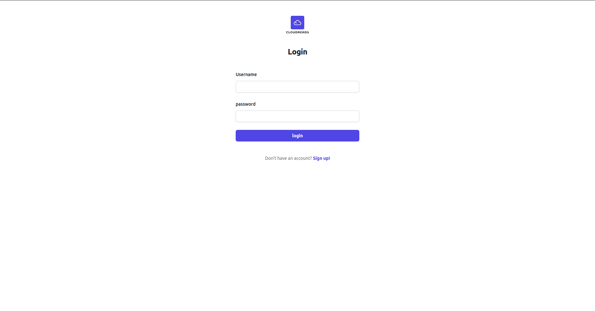
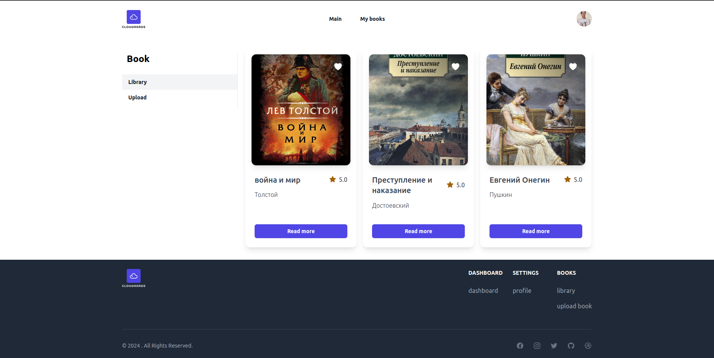

# AdminBooksFrontend

AdminBooksFrontend is a modern web application that makes it easier to manage books.

## Screenshots

Here are some visual previews of what AdminBooksFrontend offers:


*Login Page


*Book Upload Page

## Project structure

```plaintext
AdminBookFrontend/
   └── src/                       # Source code of the application
      ├── App.vue                 # Root Vue component
      ├── main.ts                 # Entry point of the application
      ├── assets/                 # Resources and assets
      │   ├── images/             # Images
      │   └── vue.svg
      ├── modules/                # Application modules
      │   ├── auth/               # Authentication module
      │   ├── book/               # Book management module
      │   ├── dashboard/          # Dashboard module
      │   └── settings/           # Settings module
      ├── router/                 # Application routing
      ├── services/               # Services for API interaction
      └── shared/                 # Shared components and composables
      │    ├── components/        # Shared components
      │    └── composables/       # Shared composables
      └── utils/                  # Utility functions and helpers
```

## Component Structure Example

```plaintext
components/
  └── UiButton/ 
      ├── index.ts             
      ├── UiButton.composables.ts
      ├── UiButton.types.ts
      └──  UiButton.vue
```

## Module Structure Example

```plaintext
moduleName/                           
    ├── components/                          
    ├── index.ts                    
    ├── router/                     
    │   └── index.ts               
    ├── static/                     
    │   └── types/                  
    │       └── index.ts            
    └── views/    
         └── ModuleView  
          ├── ModuleView.composables.ts
          ├── ModuleView.types.ts
          └── ModuleView.vue      
```

## Installation Instructions

This project requires Node.js version **19.6.1** or higher. If you don't have Node.js installed, you can download it
from the [official Node.js website](https://nodejs.org/).

### Step 1: Clone the Repository

Clone the repository to your local machine using Git:

```bash
git clone https://github.com/kirill-shakhov/AdminBooksFrontend.git
```

### Step 2: Install Dependencies

```bash
npm install
```

This command installs all the dependencies defined in the package.json file.

### Step 3: Configure Environment Variables

Before running the application, configure the necessary environment variables. Copy the .env.example file and rename it
to .env. This file serves as a template for the environment variables required by the application.

```bash
cp .env.example .env
```

### Step 4: Run the Development Server

To start the development server:

```bash
npm run dev
```

This command will launch the Vite development server, which includes features like hot module replacement.

### Step 5: Build the Application

To build the application for production:

```bash
npm run build
```

This compiles TypeScript and bundles your Vue application using Vite. The output is stored in the dist/ directory.


